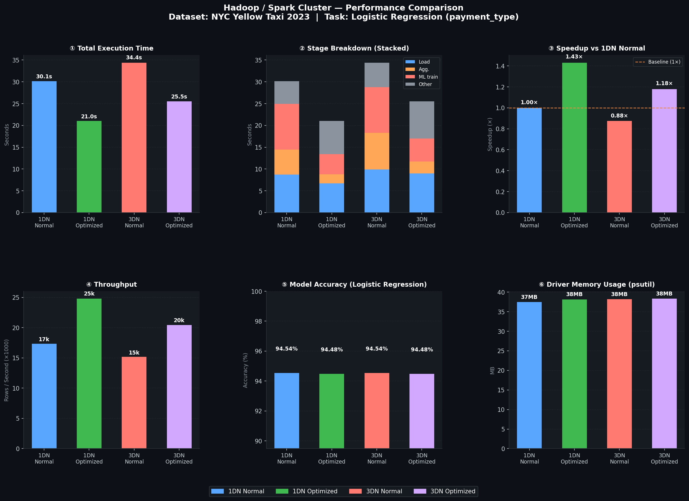
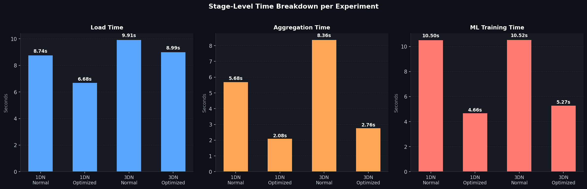

# Hadoop & Spark — Лабораторная работа №2

## Постановка задачи

Целью данной лабораторной работы является развёртывание распределённой файловой системы Hadoop (HDFS) и кластера Apache Spark в среде Docker, а также анализ влияния методов оптимизации на производительность обработки данных.

В качестве датасета используются данные **NYC Yellow Taxi Trip Records (January 2023)** — реальные записи поездок на такси в Нью-Йорке (~3 миллиона строк, формат Apache Parquet, 45 MB). Для корректной работы в пределах 1 GB-ограничения контейнеров используется выборка 17% (~521 000 строк, что в 5 раз превышает требование в 100 000 строк).

В качестве аналитической задачи разработан многоэтапный пайплайн:

1. **Load** — загрузка Parquet-файла из HDFS с подсчётом строк и семплированием
2. **Preprocessing** — приведение типов, извлечение `pickup_hour`, `pickup_dow`, формирование бинарной метки `label` (способ оплаты: карта vs наличные)
3. **Aggregations** — 4 аналитических групповых запроса: трипы по VendorID, средний тариф по часам суток, распределение способов оплаты, средние чаевые по дням недели
4. **ML Feature Engineering** — сборка вектора признаков (VectorAssembler), стратифицированное разбиение 80/20
5. **ML Training** — обучение Logistic Regression (предсказание способа оплаты)
6. **ML Evaluation** — расчёт accuracy на тестовой выборке

Для каждого этапа логируется время начала / окончания (JOB START / JOB END), идентификатор задачи в Spark UI и финальные метрики.


## Архитектура кластеров

В работе развёртываются два варианта кластера:

**Кластер A — 1 DataNode**
```
NameNode (HDFS) ── DataNode 1
Spark Master    ── Spark Worker 1  (12 ядер, 768 MB)
```

**Кластер B — 3 DataNodes**
```
NameNode (HDFS) ── DataNode 1
                ── DataNode 2
                ── DataNode 3
Spark Master    ── Spark Worker 1  (2 ядра, 768 MB)
                ── Spark Worker 2  (2 ядра, 768 MB)
                ── Spark Worker 3  (2 ядра, 768 MB)
```

Параметры HDFS: репликация × 3, размер блока **64 MB**

Параметры Spark: `executor.memory = 768m`, `driver.memory = 512m` (ограничены под `mem_limit: 1g` контейнера)


## Описание экспериментов

Запускаются 4 эксперимента:

| # | Кластер | Режим | Оптимизации |
|---|---|---|---|
| 1 | 1 DataNode | Normal | — |
| 2 | 1 DataNode | Optimized | `.persist(MEMORY_AND_DISK)`, `.cache()`, `.repartition(12)`, `shuffle.partitions=12` |
| 3 | 3 DataNode | Normal | — |
| 4 | 3 DataNode | Optimized | `.persist(MEMORY_AND_DISK)`, `.cache()`, `.repartition(12)`, `shuffle.partitions=12` |


## Инструкция по запуску

```powershell
.\run.ps1
```

Скрипт последовательно:
1. Скачает датасет NYC Taxi 2023 (только при первом запуске)
2. Поднимет кластер 1DN → запустит 2 эксперимента → остановит кластер
3. Поднимет кластер 3DN → запустит 2 эксперимента → остановит кластер
4. Сгенерирует графики в папку `charts/`

Полный лог выполнения сохраняется в `logs/run_YYYYMMDD_HHMMSS.log`.

### Мониторинг в реальном времени

Пока кластер запущен, доступны веб-интерфейсы:

| Сервис | URL | Что смотреть |
|---|---|---|
| Hadoop HDFS | http://localhost:9870 | DataNode, блоки, файлы в HDFS |
| Spark Master | http://localhost:8080 | Workers, running apps |
| Spark UI (активное приложение) | http://localhost:4040 | Jobs, Stages, Executors |


## Полученные результаты

### Сводная таблица метрик

| Эксперимент | Время (с) | Load (с) | Aggregations (с) | ML Training (с) | Accuracy |
|---|---|---|---|---|---|
| 1DN Normal | 28.47 | 7.17 | 5.33 | 11.19 | 94.54% |
| 1DN Optimized | **20.86** | 6.72 | 2.04 | **4.79** | 94.48% |
| 3DN Normal | 33.63 | 9.28 | 8.77 | 10.24 | 94.26% |
| 3DN Optimized | 27.34 | 9.48 | 3.05 | 6.51 | 94.48% |

### Графики





### Разбор по экспериментам

**Запуск 1DN Normal (28.47 с).**
Spark читает данные из HDFS без кэширования. При каждой из 4 агрегаций запускается новый Job, который поднимает данные заново. ML Training с `maxIter=15` итерациями переобращается к DataFrame на каждом шаге — это создаёт повторные вычисления. Основной bottleneck: ML Training занимает **39% общего времени** (11.19 с из 28.47 с).

**Запуск 1DN Optimized (20.86 с, ускорение ×1.36).**
После `repartition(12)` данные равномерно распределяются по 12 партициям и сохраняются через `.persist(MEMORY_AND_DISK)`. Агрегации теперь работают с данными в памяти: время упало с 5.33 с до **2.04 с** (×2.61). `.cache()` на train/test split устранил повторные вычисления при обучении LR: ML Training ускорился с 11.19 с до **4.79 с** (×2.34). Суммарно пайплайн ускорился на 26.7%.

**Запуск 3DN Normal (33.63 с).**
Три DataNode обеспечивают репликацию данных, три Worker-а (по 2 ядра) выполняют задачи параллельно. Однако суммарных ядер стало **6** против **12** в 1DN-кластере. Дополнительно — каждый shuffle-операции при агрегациях требует передачи данных между тремя узлами по сети. Результат: Aggregations заняли **8.77 с** против 5.33 с у 1DN. Общее время оказалось хуже 1DN Normal.

**Запуск 3DN Optimized (27.34 с, ускорение ×1.23).**
`.persist()` дал наибольший относительный эффект именно здесь: агрегации ускорились с 8.77 с до **3.05 с** (×2.88 — лучший среди всех экспериментов). Причина в том, что в Normal-режиме данные каждый раз физически перемещались между узлами; после кэширования каждый Worker обрабатывает только свою партицию. ML Training также ускорился: ×1.57 (10.24 с → 6.51 с).


## Анализ и выводы

**1. Оптимизация эффективна на обоих кластерах.**
`.persist()` + `.repartition()` + уменьшение `shuffle.partitions` дали ускорение ×1.36 на 1DN и ×1.23 на 3DN. Максимальный выигрыш — на стадии Aggregations (×2.6–×2.9), где устраняется повторное чтение DataFrame.

**2. 3DN медленнее 1DN при текущей конфигурации — и это ожидаемо.**
В данной лабораторной работе 1DN-кластер имеет **12 ядер** у одного Worker-а, тогда как 3DN — суммарно **6 ядер** (по 2 у каждого). Плюс — сетевой overhead при shuffle между тремя узлами. При объёме данных ~500k строк всё умещается в RAM одного Worker-а, и преимущество распределения не проявляется.

Использовать данные объёмом > 1 GB невозможно по условиям задания: каждый контейнер ограничен `mem_limit: 1g`. Parquet-файл весит 45 MB, но после десериализации в Spark DataFrame занимает ~300–500 MB в памяти. При 17% выборке (~521k строк) рабочий набор умещается в `executor.memory=768m`. Увеличение выборки до 100% привело бы к OOM-ошибке и аварийной остановке контейнера.

Таким образом, с заданным ограничением памяти эксперимент корректно демонстрирует **эффект оптимизации** (`.persist()`, `.repartition()`), однако **не может показать преимущество от масштабирования** числа нод — это требует либо снятия ограничения памяти, либо кластера с реальными объёмами данных.

**3. Кэширование train/test split критично для итерационных алгоритмов.**
Logistic Regression делает до 15 итераций. Без `.cache()` каждая итерация пересчитывает граф трансформаций от исходного DataFrame. С кэшем — данные остаются в памяти Worker-а и итерации проходят значительно быстрее. Эффект: ×2.34 на 1DN, ×1.57 на 3DN.

**4. Точность модели стабильна (94.3%–94.5%) во всех конфигурациях.**
Оптимизации касаются только плана выполнения, но не изменяют данные и алгоритм. Небольшие отклонения объясняются разным `seed` при `randomSplit` в Normal-режиме (без `.repartition(12)` исходные партиции имеют другое распределение).
